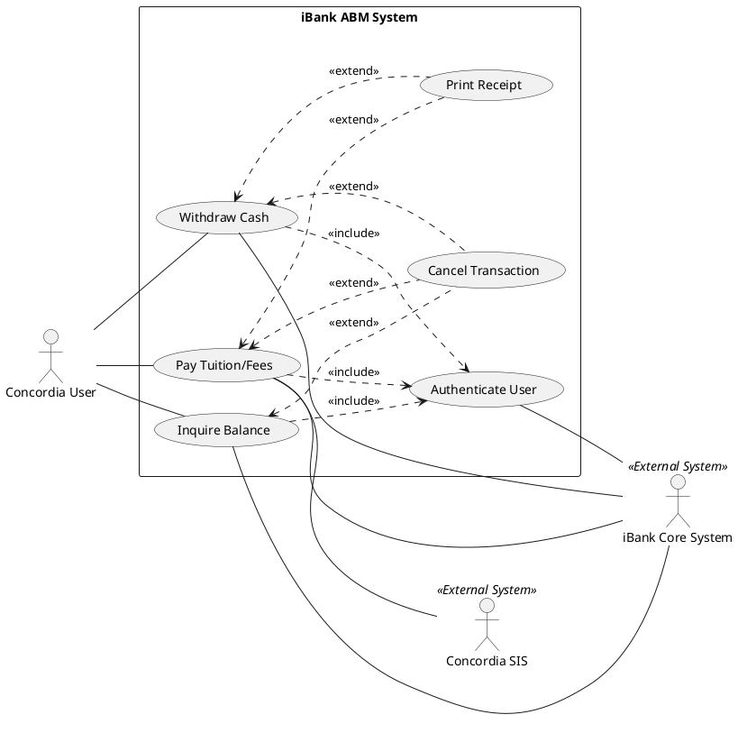

Here is an evaluation and construction of the use case model for the iBank system, structured to meet the rigorous UML standards expected in a graduate-level software engineering course.

To address the requirement that the model be both graphical and textual, I have provided the structural reasoning in text and included a standard PlantUML script. You can copy and paste this script into any UML renderer (like PlantUML's online server or an IDE plugin) to generate the visual diagram for your deliverable.

### 1. Suggested Actors

A common pitfall in use case modeling is blurring the line between human users, internal hardware, and external systems. Hardware components (like the screen or cash dispenser) are part of the system, not actors.

* **Primary Actor:** * **Concordia User:** Represents any student, faculty, or staff member initiating a session at the ABM.
* **Secondary (External) Actors:**
* **iBank Core System:** The backend banking server responsible for authorizing the PIN, verifying funds, and settling accounts. Even though iBank is a "single bank," the ABM machine itself is merely the client interface; the centralized ledger is external to the machine.
* **Concordia SIS (Student Information System):** *Crucial addition.* To support "tuition / fee payment," the ABM cannot exist in a vacuum. It must communicate with Concordia’s internal billing system to fetch balances and post successful payments.

### 2. Suggested Use Cases

Avoid the trap of functional decomposition (creating a use case for every minor button press). Use cases should represent a complete goal of value to the primary actor.

* **Main Goals:**
* `Withdraw Cash`
* `Inquire Balance`
* `Pay Tuition/Fees`

* **Supporting Use Cases (Inclusions/Extensions):**
* `Authenticate User`: Handles the PIN entry and validation against the Core System.
* `Print Receipt`: Handles the generation of a physical record.
* `Cancel Transaction`: Allows the user to gracefully abort the process.

* **Excluded as Standalone Use Cases:**
* *Language Selection (English/French):* Do not make "Select Language" a use case. In strict UML, this is an interaction step (a precondition or the first step of a primary use case narrative), not a standalone goal that provides independent value to the user.

### 3. Suggested Relationships with Reasons

This section is critical for your TA and Professor, as it demonstrates your understanding of UML semantics.

* **`<<include>>` (Mandatory execution):**
* `Withdraw Cash`, `Inquire Balance`, and `Pay Tuition/Fees` all **`<<include>>`** `Authenticate User`.
* *Reasoning:* A financial transaction or balance inquiry cannot conceptually proceed without establishing identity. The authentication behavior is factored out to avoid duplicating the PIN logic across all three main use cases.

* **`<<extend>>` (Optional or conditional execution):**
* `Print Receipt` **`<<extend>>`** `Withdraw Cash` and `Pay Tuition/Fees`.
* *Reasoning:* Generating a receipt is conditional. It depends on either the user opting in (selecting "Yes" to a receipt prompt) or the machine having paper. It is not a mandatory part of moving money.
* `Cancel Transaction` **`<<extend>>`** `Withdraw Cash`, `Inquire Balance`, and `Pay Tuition/Fees`.
* *Reasoning:* The cancellation flow is an exception path. It can be triggered at specific extension points (e.g., during amount entry, before final confirmation) to halt the base use case.

* **Associations (Communication lines):**
* The **Concordia User** is associated with the three main goal use cases.
* The **iBank Core System** is associated with `Authenticate User`, `Withdraw Cash`, `Inquire Balance`, and `Pay Tuition/Fees` to reflect backend processing.
* The **Concordia SIS** is specifically associated with `Pay Tuition/Fees`.

### 4. Issues or Assumptions to Clarify

To show strong requirements analysis in Deliverable 1, explicitly state these assumptions alongside your diagram:

1. **System Boundary Definition:** Assumption: The system boundary is strictly the *on-premises ABM software/hardware unit*. Therefore, the banking ledger and Concordia's tuition databases are explicitly modeled as external actors.
2. **Tuition Payment Mechanism:** Assumption: "Tuition / fee payment" implies a direct transfer from the user's iBank account to Concordia's financial system. We assume the system uses CAD for this transfer without requiring a currency conversion external system.
3. **Hardware States:** Assumption: Issues like "Out of Cash" or "Out of Paper" are treated as alternative flows within the main use cases (e.g., within `Withdraw Cash`) rather than requiring an "ABM Operator" actor in this specific user-centric diagram.

---

### Graphical Model (PlantUML Script)

You can use the following code to generate your UML diagram. It establishes a clear system boundary and uses strict UML syntax for includes and extends.

How do you plan to handle the textual documentation (the step-by-step narratives) for the complex use cases like `Pay Tuition/Fees`, particularly regarding the alternative flows if the Concordia SIS goes offline?